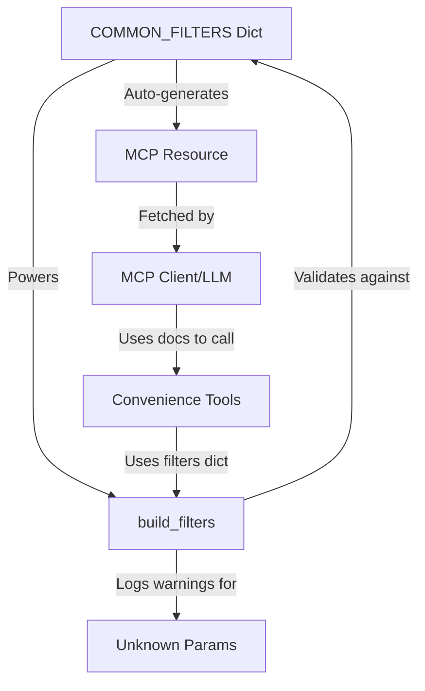

# Tenable.sc MCP Server - Architecture Documentation

**Version:** 1.2  
**Last Updated:** 2026-06-10  
**Status:** Production (v1.2.0 - Unified Filters Architecture)

---

## 📋 Table of Contents

1. [Overview](#overview)
2. [System Architecture](#system-architecture)
3. [Component Design](#component-design)
4. [Filter Documentation System](#filter-documentation-system)
5. [Unified Filters Architecture (v1.2.0)](#unified-filters-architecture-v120)
6. [Caching Strategy](#caching-strategy)
7. [Tool Organization](#tool-organization)
8. [Security Model](#security-model)
9. [Performance Optimization](#performance-optimization)

---

## Overview

Tenable.sc MCP Server is a production-ready Model Context Protocol server that provides LLMs with secure, token-efficient access to Tenable Security Center Plus vulnerability data.

**Key Design Principles:**
- **Zero Trust:** All permissions enforced by Tenable.sc RBAC
- **Token Efficiency:** 75-94% reduction via intelligent caching and data shaping
- **Modular Architecture:** Tools organized by domain with shared utilities
- **Self-Documenting:** MCP resources provide comprehensive filter documentation to LLMs
- **Unified Filters (v1.2.0):** Single `filters` dict parameter pattern across all tools
- **Performance-First:** Multi-tier caching with smart TTLs

**For detailed design principles and mandatory patterns:** See `DESIGN_PRINCIPLES.md`

---

## System Architecture

```
┌─────────────────────────────────────────────────────────────────┐
│ MCP Client Layer (OpenCode / Claude Desktop / Other)           │
│                                                                  │
│  [Tool Discovery]                                               │
│  ├─ Receives tool list with enhanced docstrings                │
│  ├─ Fetches tenable-sc://filters/reference for filter docs     │
│  └─ Can access tenable-sc://catalog for API resource listing   │
└─────────────────────────────────────────────────────────────────┘
                             │
                             ▼
┌─────────────────────────────────────────────────────────────────┐
│ Tenable.sc MCP Server (FastMCP / HTTP / Stdio)                 │
│                                                                  │
│  ┌──────────────────────────────────────────────────────────┐ │
│  │ MCP Resources Layer (NEW - v1.1)                         │ │
│  │ - tenable-sc://filters/reference → Auto-generated docs  │ │
│  │ - tenable-sc://catalog → API resource listing           │ │
│  │ Purpose: Self-documenting API for LLM consumption       │ │
│  └──────────────────────────────────────────────────────────┘ │
│                                                                  │
│  ┌──────────────────────────────────────────────────────────┐ │
│  │ Convenience Tools Layer                                  │ │
│  │ - IP Profiling (tools/ip_profiling.py)                  │ │
│  │ - Vulnerability Lookup (tools/vulnerability_lookup.py)  │ │
│  │ - Asset Discovery (tools/asset_discovery.py)            │ │
│  │ Purpose: Token-optimized high-level queries             │ │
│  └──────────────────────────────────────────────────────────┘ │
│                                                                  │
│  ┌──────────────────────────────────────────────────────────┐ │
│  │ Core Tools Layer                                         │ │
│  │ - tsc_resource_action (CRUD operations)                 │ │
│  │ - tsc_analyze (analysis queries)                        │ │
│  │ - tsc_request (direct API access)                       │ │
│  │ - tsc_catalog (resource discovery)                      │ │
│  │ Purpose: Generic API access                             │ │
│  └──────────────────────────────────────────────────────────┘ │
│                                                                  │
│  ┌──────────────────────────────────────────────────────────┐ │
│  │ Shared Utilities (convenience_tools.py)                 │ │
│  │ - build_filters() with validation warnings              │ │
│  │ - COMMON_FILTERS (55+ filter mappings)                  │ │
│  │ - Input validation (IP, CVE, severity, etc.)            │ │
│  │ - Format converters (score ranges, timestamps)          │ │
│  │ Purpose: Single source of truth for filter handling     │ │
│  └──────────────────────────────────────────────────────────┘ │
│                                                                  │
│  ┌──────────────────────────────────────────────────────────┐ │
│  │ Cache Layer (cache.py)                                   │ │
│  │ - Redis Cache (production)                              │ │
│  │ - In-Memory Cache (fallback)                            │ │
│  │ - Smart TTLs (60s-1800s based on data volatility)      │ │
│  │ - Pagination normalization (removes offset/limit)       │ │
│  │ Purpose: 90% token savings, 1000x speed improvement     │ │
│  └──────────────────────────────────────────────────────────┘ │
│                                                                  │
│  ┌──────────────────────────────────────────────────────────┐ │
│  │ API Client Layer (client.py)                            │ │
│  │ - TenableScClient (REST API wrapper)                    │ │
│  │ - HMAC signature authentication                         │ │
│  │ - Automatic retries (3x with exponential backoff)       │ │
│  │ Purpose: Reliable Tenable.sc API communication          │ │
│  └──────────────────────────────────────────────────────────┘ │
└─────────────────────────────────────────────────────────────────┘
                             │
                             ▼
┌─────────────────────────────────────────────────────────────────┐
│ Tenable Security Center Plus                                    │
│ - RBAC enforcement (all permissions from API keys)             │
│ - Vulnerability data (scans, plugins, analysis)                │
│ - Asset management (repositories, groups)                      │
└─────────────────────────────────────────────────────────────────┘
```

---

## Component Design

### 1. MCP Resources Layer (NEW - v1.1)

**Purpose:** Provide comprehensive, auto-generated documentation to LLMs via MCP protocol.

**Implementation:** `src/tenable_sc_mcp/resources/`

**Key Resources:**
- `tenable-sc://filters/reference` - Complete filter documentation auto-generated from `COMMON_FILTERS`
- `tenable-sc://catalog` - API resource listing

**Design Goals:**
1. **Self-Documenting API:** LLMs can fetch filter docs instead of guessing parameter names
2. **Auto-Generated:** Docs generated from code (COMMON_FILTERS dict) - never out of sync
3. **Comprehensive:** All 55+ filters with descriptions, examples, format requirements
4. **Token-Efficient:** Single resource fetch provides complete reference

**Benefits:**
- Eliminates parameter name mismatches (e.g., `acr_score` vs `asset_criticality`)
- Prevents operator format errors (e.g., `">7"` vs `"7-10"`)
- Reduces support burden - LLM can self-educate
- Enables complex multi-filter queries with confidence

**Example Resource Content:**
```markdown
# Tenable.sc Analysis Filter Reference

## Scoring Filters (RANGE FORMAT REQUIRED)

| Parameter | Scale | Example | Description |
|-----------|-------|---------|-------------|
| asset_criticality | 0-10 | "7-10" | Asset Criticality Rating |
| vpr_score | 0-10 | "8-10" | Vulnerability Priority Rating |
...

## Common Mistakes
1. Using operators (">7") instead of ranges ("7-10")
2. Wrong parameter names ("acr_score" → use "asset_criticality")
...
```

---

### 2. Filter Validation System (NEW - v1.1)

**Purpose:** Warn users about unknown filter parameters instead of silently ignoring them.

**Implementation:** `build_filters()` in `convenience_tools.py`

**How It Works:**
1. When `build_filters(**kwargs)` is called, it checks each parameter against `COMMON_FILTERS`
2. Unknown parameters are tracked in `unknown_params` list
3. If `validate=True` (default), logs WARNING with helpful guidance
4. Warning includes:
   - List of unknown parameters
   - Reference to MCP resource for valid filters
   - Common mistake hints (e.g., "acr_score" → "asset_criticality")

**Example Warning:**
```
WARNING: Unknown filter parameters will be ignored: acr_score, hostname.
These parameters were not found in COMMON_FILTERS.
For valid filter names, see MCP resource: tenable-sc://filters/reference
Common mistakes: 'acr_score' should be 'asset_criticality', 
'hostname' should be 'dns_name'.
```

**Benefits:**
- Users get immediate feedback on typos
- Reduces "silent failure" frustration
- Points users to documentation
- Non-breaking (warnings, not errors)

---

### 3. Convenience Tools Layer

**Purpose:** High-value, token-optimized tools for common security workflows.

**Organization:** Domain-specific modules in `src/tenable_sc_mcp/tools/`

**Modules:**
- `ip_profiling.py` - Tool 1: Complete IP security profiles
- `vulnerability_lookup.py` - Tools 2a, 2b, 5: Vulnerability queries and CVE search
- `asset_discovery.py` - Tool 4: IP enumeration and discovery

**Shared Pattern (v1.2.0):**
- Accept `filters: dict[str, Any] | None = None` parameter for flexible filtering
- Call `build_filters(**filter_dict)` to generate API filter objects
- Use `tsc_analyze()` with smart caching
- Return shaped, token-efficient responses

**Tool Registration:**
- Each module exports `register_tools(mcp)` function
- `tools/__init__.py` imports all and provides `register_all_tools()`
- Server calls `register_all_tools(mcp)` during initialization

---

### 4. Universal Filter Framework

**Purpose:** Single source of truth for all 55+ Tenable.sc analysis filters.

**Implementation:** `COMMON_FILTERS` dict in `convenience_tools.py`

**Structure:**
```python
COMMON_FILTERS = {
    # User-friendly name → Tenable.sc API filter name
    "asset_criticality": "assetCriticalityRating",
    "vpr_score": "vprScore",
    "aes_score": "assetExposureScore",
    ...
}
```

**Used By:**
- `build_filters()` - Converts filter dict to API filters
- `filter_reference.py` - Auto-generates documentation
- All 4 convenience tools with filtering support

**Maintenance:**
- Add new filter: Update dict → appears in tools + docs automatically
- No duplication across codebase
- Zero tool edits required

---

## Filter Documentation System

### Architecture Flow



### Design Decisions

**Q: Why MCP Resource instead of tool parameter docs?**
- Tool docstrings with 55+ filters → too verbose for LLM context
- Resource fetched once, cached, referenced as needed
- Allows detailed examples without bloating tool signatures

**Q: Why auto-generation instead of handwritten docs?**
- Eliminates drift between code and docs
- Add filter once in `COMMON_FILTERS` → appears everywhere
- Maintainability: single source of truth

**Q: Why validation warnings instead of errors?**
- Non-breaking for existing tools/users
- Some parameters may be valid but undocumented
- Warnings provide guidance without blocking workflows

---

## Unified Filters Architecture (v1.2.0)

**Breaking change introduced in v1.2.0 for improved maintainability and MCP compatibility.**

### The Problem (Pre-v1.2.0)

**Explicit filter parameters caused:**
- 100+ lines of parameter declarations per tool
- 12+ edits required to add a new filter (4 tools × 3 locations each)
- High duplication and maintenance burden
- MCP `**kwargs` limitation (treated as literal param name, not variable expansion)

**Old Pattern (DEPRECATED):**
```python
@mcp.tool()
def tool_name(
    param: str,
    asset_criticality: str | None = None,  # 55+ explicit params
    vpr_score: str | None = None,
    # ... 50+ more parameters
    **kwargs: Any  # ❌ MCP limitation: serializes as {"kwargs": {...}}
):
    filters = build_filters(
        asset_criticality=asset_criticality,
        vpr_score=vpr_score,
        # ... repeat all 55 parameters
    )
```

### The Solution (v1.2.0)

**Unified filters dict parameter:**
```python
@mcp.tool()
def tool_name(
    param: str,
    filters: dict[str, Any] | None = None,  # ✅ All 55+ filters via single param
) -> dict[str, Any]:
    """
    Args:
        filters: Optional dict of filter parameters.
            For complete filter reference: tenable-sc://filters/reference
            
            Common filters:
                asset_criticality: ACR range (e.g., "7-10")
                vpr_score: VPR range (e.g., "7-10")
                severity: critical/high/medium/low/info
    """
    filter_dict = filters or {}
    filter_list = build_filters(**filter_dict)  # Unpack dict to build_filters()
```

### Benefits

**For Maintainers:**
- 5 lines instead of 100+ per tool
- Add new filter = 1 edit to `COMMON_FILTERS` (zero tool edits)
- Zero duplication
- Scales to 25+ tools

**For Users:**
- Consistent interface across all tools
- All 55+ filters available everywhere
- Better error messages with validation

**For MCP Protocol:**
- Explicit `dict` type for dynamic parameters
- Avoids `**kwargs` serialization bug
- Proper JSON Schema generation

### Migration Path

**Before (v1.1):**
```python
tsc_list_ips(repository="Default", asset_criticality="8-10", severity="critical")
```

**After (v1.2):**
```python
tsc_list_ips(
    repository="Default",
    filters={"asset_criticality": "8-10", "severity": "critical"}
)
```

**See:** `REFACTOR_SUMMARY.md` for complete migration guide.

### Implementation Status

**Refactored (v1.2.0):**
- ✅ Tool 1: `tsc_profile_ip_efficient` (no filters, N/A)
- ✅ Tool 2a: `tsc_list_vulns_by_ip_summary` (uses `filters: dict`)
- ✅ Tool 2b: `tsc_list_vulns_by_ip_full` (uses `filters: dict`)
- ✅ Tool 4: `tsc_list_ips` (uses `filters: dict`)
- ✅ Tool 5: `tsc_list_vulns_by_cve` (uses `filters: dict`, fixed MCP bug)

**Future Tools (6-25):**
- MUST follow unified filters dict pattern
- See `DESIGN_PRINCIPLES.md` for mandatory patterns

---

## Caching Strategy

### Multi-Tier Cache Design

**Tier 1: In-Memory (Development)**
- Fast, zero-dependency
- Cleared on restart
- Suitable for local testing

**Tier 2: Redis (Production)**
- Persistent across restarts
- Shared between multiple server instances
- Recommended for production deployments

### Smart TTL System

**Cache TTL by Data Volatility:**

| Data Type | TTL | Examples | Rationale |
|-----------|-----|----------|-----------|
| Static | 24 hours | Plugins, families | Rarely changes |
| Semi-static | 30 minutes | Repositories, policies | Occasional updates |
| Dynamic | 10 minutes | Assets, queries | Moderate change rate |
| Real-time | 1-5 minutes | Scans, scan results | Frequent updates |
| Analysis (Smart) | 1-5 minutes | Adapts to query type | Balance freshness vs performance |

**Analysis Tool-Specific TTLs:**
- `sumip`, `sumasset`: 5 minutes (asset data)
- `vulndetails`, `vulnipsummary`: 3 minutes (vulnerability data)
- `listvuln`, `liststuln`: 4 minutes (CVE searches)
- `listening`, `event`: 1 minute (real-time status)

### Pagination Normalization

**Problem:** Pagination parameters create unique cache keys for identical data.
**Solution:** Remove `startOffset`/`endOffset` from cache key generation.
**Result:** 94% token reduction on repeated paginated queries.

---

## Tool Organization

### Modular Structure

```
src/tenable_sc_mcp/
├── server.py (core MCP server)
├── client.py (Tenable.sc API client)
├── cache.py (caching system)
├── convenience_tools.py (shared utilities)
├── resources/ (NEW - v1.1)
│   ├── __init__.py
│   └── filter_reference.py (auto-generated docs)
└── tools/ (convenience tools)
    ├── __init__.py
    ├── ip_profiling.py (Tool 1)
    ├── vulnerability_lookup.py (Tools 2a, 2b, 5)
    └── asset_discovery.py (Tool 4)
```

### Design Principles

1. **Domain Separation:** Tools grouped by functionality (IP, vuln, asset)
2. **Shared Utilities:** Filter handling, validation, formatting centralized
3. **Lazy Registration:** Tools registered at runtime, not import time
4. **Backward Compatibility:** Legacy tool functions preserved via `_tool_functions` dict

---

## Security Model

### Principle: Zero Trust

**The MCP server does NOT bypass Tenable.sc security:**
- Uses API keys configured by user
- All Tenable.sc RBAC rules enforced
- No credential storage or caching
- Read-only by default (write operations require explicit user action)

### Authentication Flow

```
User → MCP Client → MCP Server → Tenable.sc
                                   ↓
                         HMAC Authentication (API Keys)
                                   ↓
                           RBAC Check (User Roles)
                                   ↓
                          Return Data (if authorized)
```

### API Key Management

**Best Practices:**
- Create dedicated least-privilege API user in Tenable.sc
- Store keys in environment files (mode 0600)
- Never commit keys to git
- Rotate keys regularly

**MCP HTTP Endpoint Security:**
- No built-in authentication
- Bind to `127.0.0.1` for local-only access
- Use firewall rules or SSH tunnels for remote access
- Consider OAuth proxy for public exposure

---

## Performance Optimization

### Token Savings Summary

| Tool | Raw API | Optimized | Reduction | Method |
|------|---------|-----------|-----------|--------|
| tsc_profile_ip_efficient | 15,000 | 2,500 | 83% | Multi-query + cache + shaped output |
| tsc_list_vulns_by_ip_summary | 6,000 | 700 | 88% | Aggregation only, no details |
| tsc_list_vulns_by_ip_full | 12,000 | 5,000 | 58% | Field filtering + pagination |
| tsc_list_ips | 9,000 | 500 | 94% | IP-only mode + cache normalization |
| tsc_list_vulns_by_cve | 10,000 | 1,500 | 85% | IP deduplication + severity aggregation |

### Optimization Techniques

1. **Field Filtering:** Request only needed fields from API
2. **Pagination:** Default small batches, expand on demand
3. **Aggregation:** Return counts instead of full records when possible
4. **Deduplication:** Remove duplicate records at server side
5. **Cache Normalization:** Ignore pagination params in cache keys
6. **Shaped Output:** Format data for LLM consumption (structured, concise)

### Cache Performance

**Metrics (Production):**
- Hit Rate: 57-80% (depending on query patterns)
- Cache Hit Response: <1ms
- Cache Miss Response: 200-500ms
- Token Savings: 90% with caching (vs 75% without)

---

## Future Enhancements

### Planned for v1.2

1. **Bulk IP Profiling** (Tool 19)
   - Profile 10-50+ IPs in one call
   - Parallel query execution
   - Shared cache across IPs

2. **Credential Audit Tool** (Tool 13)
   - Parse plugin 19506 + auth plugins
   - Credential success/failure per protocol
   - Identify unauthenticated scans

3. **Missing Patches Tool** (Tool 6)
   - MS bulletin-based gap analysis
   - Windows patch compliance
   - Remediation prioritization

### Potential v2.0 Features

- **Output Schema Validation:** Define expected output formats for strict validation
- **Tool Annotations:** Priority, audience metadata for better client handling
- **Streaming Results:** Support for large result sets (>1000 records)
- **Webhook Support:** Real-time updates for scan completion, new vulnerabilities
- **Multi-Tenancy:** Support multiple Tenable.sc instances in one server

---

## Version History

- **v1.1** (2026-06-10): Added filter documentation system (MCP resources + validation)
- **v1.0** (2026-06-08): Production release with 5 convenience tools + caching
- **v0.2.0** (2026-06-06): Added Redis caching and smart TTL system
- **v0.1.0** (2026-05-15): Initial release with core CRUD tools

---

## References

- **MCP Specification:** https://modelcontextprotocol.io/docs
- **Tenable.sc API Docs:** https://docs.tenable.com/security-center/api/index.htm
- **Project README:** README.md
- **Tool Roadmap:** TOOLS_ROADMAP.md
- **Caching Deep Dive:** CACHING_DEEP_DIVE.md
- **Test Prompts:** TEST_PROMPTS.md
